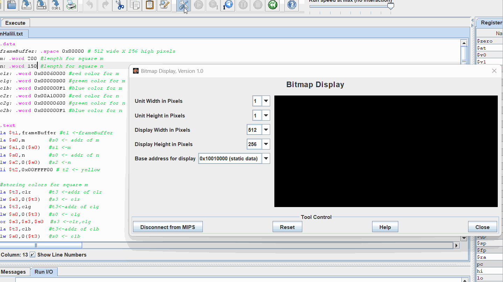

# MIPS-Project
## Description
This project creates a 256 pixels high and 512 pixels wide yellow background, a square and its diagonals and another square. Both squares are centered in the middle. The color and size of the squares can be changed.

## Data
The data for the example:  
.data  
frameBuffer: .space 0x80000 # 512 wide X 256 high pixels  
m: .word 200 #length for square m  
n: .word 150 #length for square n  
c1r: .word 0x00060000 #red color for m  
c1g: .word 0x0000DD00 #green color for m  
c1b: .word 0x000000F1 #blue color for m  
c2r: .word 0x00A10000 #red color for n  
c2g: .word 0x00000600 #green color for n  
c2b: .word 0x000000F1 #blue color for n  

GIF created with LiceCap

## Notes 
There were some issues with keeping track of what registers were being used for what since there were so many shapes being built. Diagonals proved challenging at first, especially because the method for one could not be entirely replicated for the other. 
